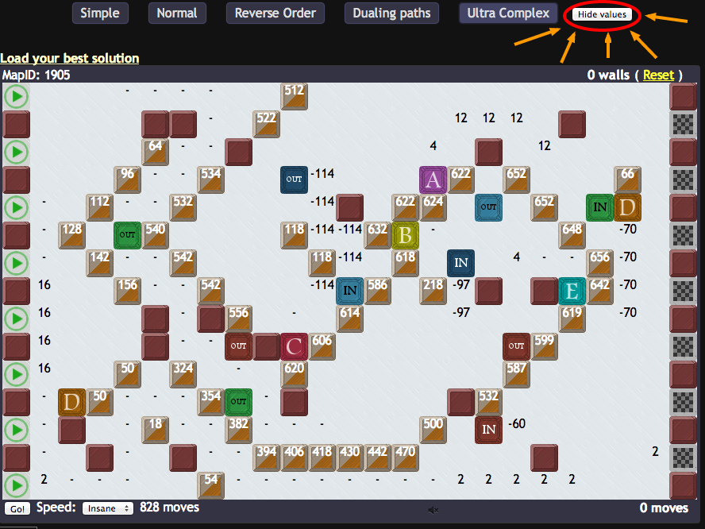
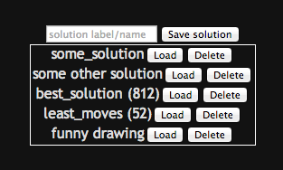

# MIDNIGHT THERAPY #

## OVERVIEW ##

This code is meant to be an interface between the Pathery website and a server.  
With a human interacting with the browser, it effectively facilitates human-computer interaction.
Besides interacting with the server, the client (browser) does things like client-side pathing and display, and in the future, load/save of solutions, and more.
However, for those of us who aren't tech savvy, or don't want to run a server, I've provided an in-browser "server".

The values on the blocks is currently white, so it works best with darker blocks.  (I'll make the font color better/customizable in the future.)

## FEATURES ##

### CLIENT-SIDE PATHING ###

Check this out:

You can have something which updates your score as you place blocks!
The score is shown next to the speed dropdown.  Remember, the score IS NOT SUBMITTED FOR YOU.

If you press "show values", you'll see block values for every block.  
However, this may feel laggy if you're letting the browser do the computation.

### SOLUTION LOAD AND SAVE ###

It's often frustrating that you can only load your best solution, on maps with many viable but different placings.  
On UC especially, it can be devastating to accidentally press Load Best Solution.  
Thus I added the ability to save and load solutions.  Simply enter a name, and press Save, to save the current solution.
You'll then see the name appear in a list, where you can Load or Delete it.

## INSTRUCTIONS FOR USE ##

### SIMPLE: ###

1. Go to Pathery
2. Paste:

`$.getScript('https://raw.github.com/WuTheFWasThat/midnighttherapy/master/pathery-full.js')`

into the Javascript console.

To make this even easier, make it a bookmarklet.  That is, create a bookmark with the address:

`javascript: $.getScript('https://raw.github.com/WuTheFWasThat/midnighttherapy/master/pathery-full.js')`

You can then just visit this bookmark while you're at Pathery.

### OUTSOURCING COMPUTATION TO A SERVER (recommended if using "show values", and necessary if interfacing with your own solver): ###

1. Clone this repo and cd into it
2. Run locally:

`node pathery-server.js`

3. Go to Pathery
4. Paste

`$.getScript('https://raw.github.com/WuTheFWasThat/midnighttherapy/master/pathery-client.js')`

into the Javascript console.  Again, you can make this easier for yourself by saving bookmark with address:

`javascript: $.getScript('https://raw.github.com/WuTheFWasThat/midnighttherapy/master/pathery-client.js')`

## KNOWN ISSUES: ##

None, at the moment.  Let me know if you find any! 

## FUTURE WORK: ##

- An API to support solvers that actually suggest (potentially major) changes, takes suggestions, etc. (and an accompanying prototype)
- Undo
- Make the [dumb] thing faster (currently does 400 full UC calculations per second... )

Feel free to contribute, of course :)
