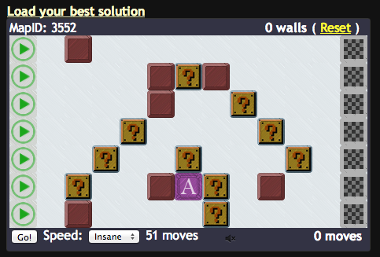

# MIDNIGHT THERAPY #

<!--
## TABLE OF CONTENTS ##
* [OVERVIEW]
* [FEATURES]
* [INSTRUCTIONS]
* [KNOWN ISSUES]
* [FUTURE WORK]
-->

## OVERVIEW ##

This project is an extension to the Pathery website (www.pathery.com).  It does two main things:

1. Extend the client (browser) to do things like show block values and save/load of solutions.
2. Lets the website interact with a personal server (running a solver), to facilitate human-computer interaction.

## HOW TO INSTALL ##

### GREASEMONKEY ###

1. Install [Tampermonkey](https://chrome.google.com/webstore/detail/tampermonkey/dhdgffkkebhmkfjojejmpbldmpobfkfo?hl=en) *(Chrome)* or [Greasemonkey](https://addons.mozilla.org/en-US/firefox/addon/greasemonkey/) *(Firefox)*
2. Click [this link](https://raw.github.com/WuTheFWasThat/midnighttherapy/master/monkey-script.user.js).

### BOOKMARKLET ###

If you can't or don't want to use Greasemonkey, use a bookmarklet.  That is, create a bookmark with the address:

`javascript: $.getScript('https://raw.github.com/WuTheFWasThat/midnighttherapy/master/pathery-full.js')`

### CONSOLE ###

If all else fails, you can access the script by pasting

`$.getScript('https://raw.github.com/WuTheFWasThat/midnighttherapy/master/pathery-full.js')`

into the Javascript console.

## FEATURES ##

### CLIENT-SIDE PATHING ###

Check this out:

You can have something which updates your score as you place blocks!
The score is shown next to the speed dropdown.

If you press "show values", you'll see block values for every block.
However, this may feel laggy if you're letting the browser do the computation.

### SOLUTION LOAD AND SAVE ###

Simply enter a name and press "Save solution" (or use the hotkey S) to save a solution under some name.
If no name is entered, a default name is chosen based on the score of the solution.
You'll then see the name appear in a list, where you can Load or Delete it.

If you want your solution saving to persist, you'll need a browser that supports HTML5 storage!
If your browser doesn't support HTML5 local storage, you really should upgrade it...

### HOTKEYS ###

I provide a number of hotkeys to make playing easier and faster:

| Hotkey        | Action                           |
| ------------- |:-------------------------------- |
| 1-5           | Switch between maps              |
| G             | Go! (hold shift to animate)      |
| R             | Reset                            |
| L             | Load best solution               |
| S             | Save solution                    |
| M             | Toggle mute                      |
| V             | Toggle values                    |
| W             | Wall (paint)                     |
| E             | Erase (paint)                    |
| X             | Toggle block                     |
| Z             | Undo                             |
| Y             | Redo                             |
| Shift+Click   | Draw line from most recent block |

### OTHER ###

- As you might have noticed, you can customize your block and wall images.
- Score auto-submit
- Automatic tracking of best score

## SERVERSIDE PATHING ##

### RUNNING THE SERVER ###

Unfortunately, "show values" is noticeably slow using the default method.  The following method, though more complicated, speeds up the pathfinding by a great deal.

First you'll need a server running.  I've provided one that you can use (maybe as a starting point for an AI).  To get it,

1. Clone this repo and cd into it
2. Run locally:

`node pathery-server.js` (or just `npm start`, if you have npm)

Next, add my client to the browser window.

1. Go to Pathery
2. Paste

`$.getScript('https://raw.github.com/WuTheFWasThat/midnighttherapy/master/pathery-client.js')`

into the Javascript console.  Again, you can make this easier using something like Tampermonkey/Greasemonkey (a slight modification to monkey-script.js will work), or a bookmarklet.

<!--
### SERVER API ###

I'll get to this sometime...
-->

## KNOWN ISSUES: ##

- After erasing a block, you can't shift click to it

- Sometimes you can get into a state where clicking a block puts it somewhere else... (unclear how to reproduce)

- Improve (I) seems messed up, caused decreased score on a seeing double

<!--
None, at the moment.  Let me know if you find any!
-->

## FUTURE WORK: ##

- Disable new day alert, auto refresh

- Disable achievement earn alert

- Cleanup of old saved solutions

- Notifications when scores are beat?

- Ability to view person's times/scores

- More customization? e.g. shown values colors, etc.

- Chat in the main page

- An API to support solvers that actually suggest (potentially major) changes, takes suggestions, etc. (and an accompanying prototype)

- Make the it faster! (currently does ~1000 full UC calculations per second on my Macbook Air, in Node.js (which is single threaded))

- Make painting/erasing atomic for undo?

## CONTACT: ##

Suggestions and feedback are welcome.  If you can't catch me in the Pathery chat, there's a mailing list for updates and discussions:

  midnight-therapy@zeromailer.com

To join it:

  https://www.zeromailer.com/join/midnight-therapy

Feel free to contribute, of course :)

Thanks to those who already have: BlueRaja, HRoll, Joy, skishore, wuthefwasthat

